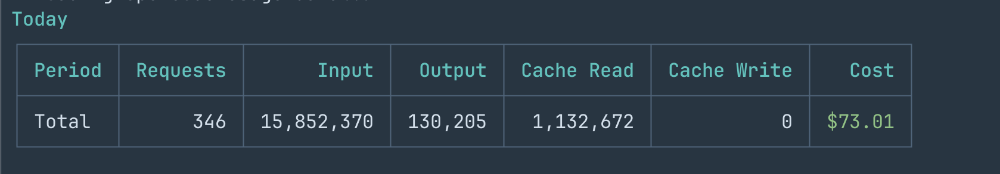
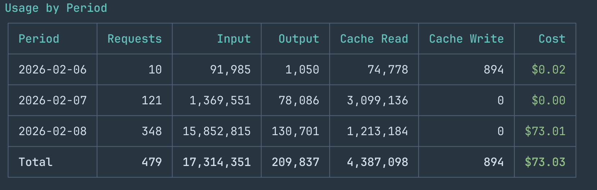
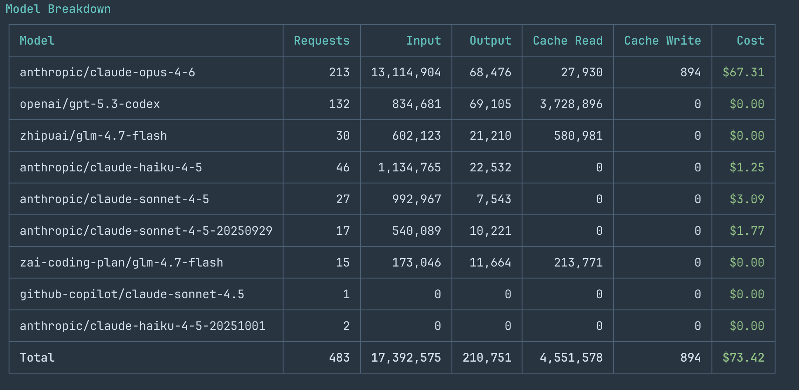

# oc-stats

CLI tool to analyze [OpenCode](https://opencode.ai) usage statistics — requests, tokens, cost, broken down by time period or model.

## Screenshots

**Default — Today's summary:**



**Daily breakdown:**



**Model breakdown:**



## Install

```bash
npx oc-stats
```

Or install globally:

```bash
npm install -g oc-stats
```

## Usage

```bash
# Today's summary (default)
oc-stats

# Time period breakdown
oc-stats daily
oc-stats weekly
oc-stats monthly
oc-stats yearly

# Model breakdown
oc-stats models
```

### Filters

All commands support the following flags, and they can be combined freely:

| Flag | Description | Example |
| --- | --- | --- |
| `-m, --model <model>` | Filter by model | `-m anthropic/claude-opus-4-6` |
| `--from <date>` | Start date (YYYY-MM-DD) | `--from 2026-02-01` |
| `--to <date>` | End date (YYYY-MM-DD) | `--to 2026-02-08` |

```bash
# Daily stats for a specific model
oc-stats daily -m anthropic/claude-opus-4-6

# Model breakdown for a date range
oc-stats models --from 2026-02-03 --to 2026-02-08

# Combined
oc-stats weekly -m openai/gpt-5.3-codex --from 2026-01-01 --to 2026-02-01
```

## Data Source

Reads OpenCode's local storage at `~/.local/share/opencode/storage/message/`.

## Development

```bash
pnpm dev              # Run with tsx (no build needed)
pnpm build            # Build with tsup
pnpm test             # Run tests
```

## License

MIT
